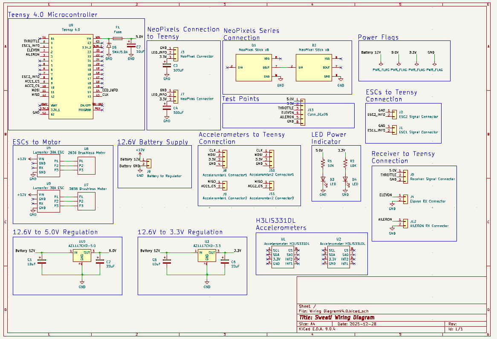
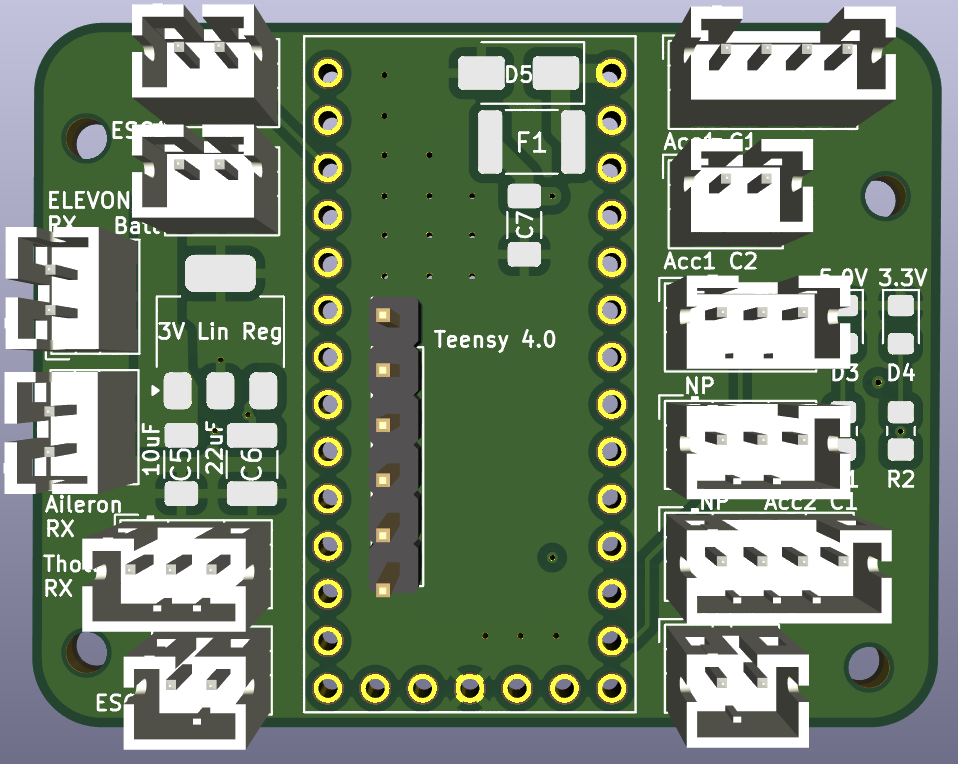
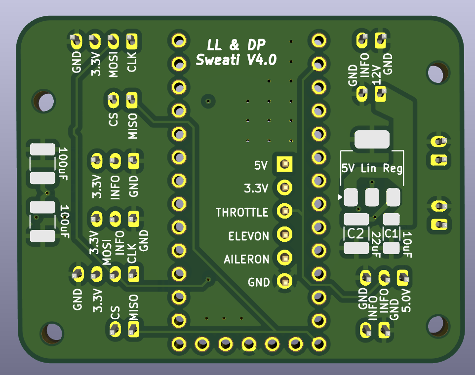
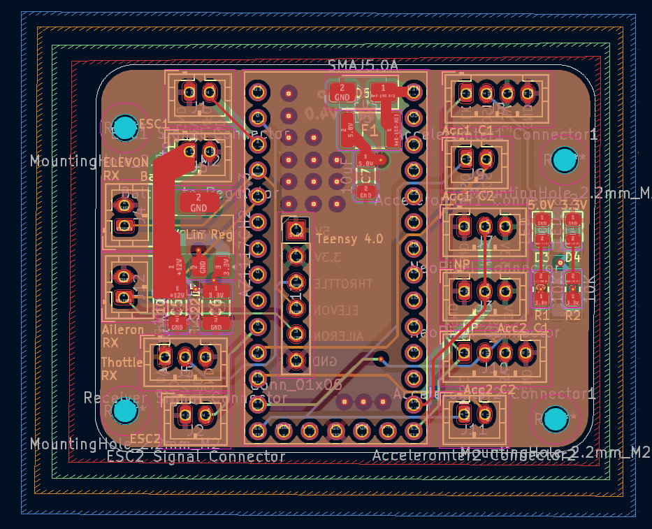
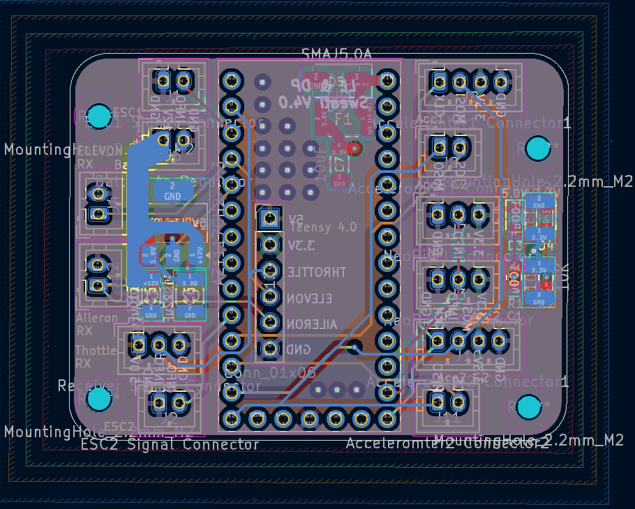
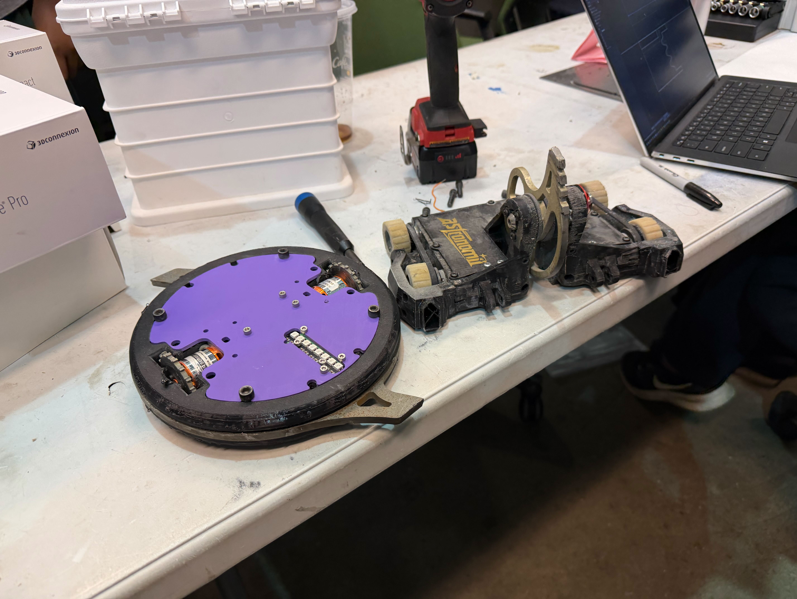

# Manipulating Translational Drift - Combat Robotics

**ECE 4180 Final Project**

**Authors:** Liam Long

---

## What the Project Does

Sweati is a 3-pound full-body spinner combat robot that uses the "melty brain" control strategy. In a conventional combat robot, the weapon and the drivetrain are separate systems. In a melty brain design, the entire chassis is the weapon — the robot spins as a solid ring at up to 3,000 RPM while simultaneously translating across the arena floor. This is achieved by precisely timing brief motor speed differentials to a known heading angle, so that the push applied to the floor is always in the same absolute direction regardless of which way the robot is currently facing.

The core engineering challenge is that the robot cannot see where it is pointing. It has no magnetometer, no camera, no GPS. It infers its heading entirely from centripetal acceleration measured by two onboard accelerometers, integrates that angular velocity in real time, and uses the result to gate the motor mix at 1,000 Hz. The LED strips mounted to the chassis flash only during the "forward" half of each rotation, giving the driver a visual beacon to aim with.

---

## Hardware Components

### Teensy 4.0 — Main Controller

The Teensy 4.0 is the compute core of the robot. It runs at 400 MHz with a 32-bit ARM Cortex-M7 and provides hardware floating-point, which is necessary for the real-time trigonometric operations in the motor mix (`cosf` called at 1 kHz). It was chosen over alternatives such as the Raspberry Pi Pico or Arduino Mega for three reasons: raw compute speed, hardware SPI for dual accelerometer communication, and the WS2812Serial library which uses DMA to drive the LED strips without blocking the main loop. The Teensy also provides hardware PWM at 400 Hz on multiple pins simultaneously, which is required to drive two ESCs independently. EEPROM emulation is used to persist the sensor calibration radius across power cycles.

### Custom Four-Layer PCB

A custom four-layer PCB was designed to mount the Teensy, both SPI accelerometers, ESC signal headers, RC receiver header, and LED data line in a compact form factor that fits within the robot's chassis. The PCB eliminates loose wiring that would fail under the centripetal loads experienced at 3,000 RPM (up to 450g at the sensor mounting radius). Decoupling capacitors are placed on each SPI device's power rail to suppress high-frequency noise from the ESCs coupling into the accelerometer readings. The board uses a 3.3V LDO regulator to supply the microcontroller and sensors from the 11.1V LiPo.

### H3LIS331DL Accelerometers (×2)

Two Adafruit H3LIS331DL high-g SPI accelerometers are mounted at a known radial offset from the center of rotation. The H3LIS331DL was selected because it measures up to ±400g — necessary because at 3,000 RPM and a 1.566-inch sensor radius, centripetal acceleration reaches 400g. A standard consumer MEMS sensor rated at ±16g would immediately saturate. Both sensors communicate over a shared SPI bus with separate chip-select lines. Each sensor independently measures centripetal acceleration; omega is computed from each using `ω = √(a/r)`, and the two results are averaged to reduce noise. The sensor radius `r` is user-tunable at runtime via a calibration mode that writes the value to EEPROM. The data rate is set to 1,000 Hz to match the main loop frequency.

### RC Receiver (FlySky FS-iA6B)

The RC receiver decodes three PWM channels: throttle, elevon (forward/back translation), and aileron (heading trim). Each channel is read using a hardware interrupt on the Teensy — a rising edge ISR records a `micros()` timestamp, and the falling edge ISR computes the pulse width. The results are written to `volatile uint16_t` globals and read atomically in the main loop with interrupts disabled. This architecture ensures that the main loop never blocks waiting for RC input and that partial writes to multi-byte variables cannot produce corrupted readings. Valid pulse widths are gated between 900µs and 2100µs; any value outside this range is discarded as noise.

### FlySky FS-i6 Transmitter

The FlySky FS-i6 6-channel transmitter communicates with the receiver over the AFHDS 2A 2.4 GHz frequency-hopping protocol. Three channels are used: left stick vertical (throttle), right stick vertical (elevon/translation), and right stick horizontal (aileron/heading trim). The transmitter's failsafe is configured to hold all channels at their last valid position, which means a signal loss at full throttle does not automatically disarm the robot — the safety watchdog implemented in firmware handles this case by locking the robot after 30 seconds of no RC activity change exceeding 100µs.

### Electronic Speed Controllers — Repeat Robotics 30A BLDC ESCs (×2)

Two 30-amp brushless ESCs drive the weapon/drive motors. The ESCs receive standard 400 Hz PWM signals from the Teensy (1000–2000µs pulse width). The arming sequence at boot sends 1040µs (minimum), then 1960µs (maximum), then 1040µs again to comply with the ESC's power-on calibration protocol. During normal operation both ESCs receive the same throttle signal modulated by the heading-weighted motor mix. The mix differentially adjusts one motor up and one motor down by up to 100µs, which is the power delta Jim Kazmer recommended to prevent cleat slip with the added ring inertia.

### Motors — FlashHobby D2836 1500KV BLDC (×2)

The FlashHobby 2836 1500KV motors were selected as a compact, high-speed alternative capable of meeting the drivetrain’s torque and RPM requirements while reducing overall system mass. With a KV rating of 1500, the motor provides a no-load speed of approximately 16,650 RPM on a 3S (11.1V) battery, offering sufficient headroom above the required shaft speed to achieve the target 3,000 RPM robot spin through the drivetrain ratio.

### Battery — 3S LiPo 930mAh 75C

An 11.1V 3-cell lithium polymer pack powers the robot. The 75C discharge rating means it can supply up to 69.75A continuously, well above the combined peak draw of two 30A ESCs. The 930mAh capacity provides approximately 3 minutes of competition-intensity runtime. The pack connects through a XT30 connector directly to the ESC power inputs; the BEC output from one ESC supplies 5V to the RC receiver, and the PCB LDO steps that down to 3.3V for the Teensy and sensors.

---

## Software Architecture

The firmware is structured around a 1 kHz main loop on the Teensy 4.0. Each iteration reads an atomic RC snapshot, runs the safety watchdog check, reads both accelerometers via SPI, updates the trapezoidal heading integration, evaluates the calibration state machine, computes the motor mix, writes PWM to both ESCs, and updates the LED strips via DMA. The heading integration uses the trapezoidal rule (`θ += (ω_prev + ω_now) / 2 × dt`) rather than Euler integration, which reduces per-step error from O(dt²) to O(dt³) — important when accumulating over thousands of steps per second.

A calibration mode allows runtime adjustment of the sensor radius via the aileron stick, with the value written to EEPROM immediately. A safety watchdog locks the robot after 30 consecutive seconds of no RC channel change exceeding 100µs, setting the LEDs to solid blue and holding both ESCs at minimum until power is cycled.

---

## Problems Encountered

**Sensor saturation:** The initial sensor radius of 1.76 inches caused the H3LIS331DL to saturate at 3,000 RPM, producing clipped acceleration readings and corrupted omega estimates. The sensor was moved inward to stay below the 400g saturation limit at operating speed, and the EEPROM calibration system allows fine-tuning without reflashing.

**Cleat slipping with the ring:** Adding the AR500 ring significantly increased system inertia. The original 200µs power delta caused the wheel cleats to exceed the shear strength of the floor's wood grain during translation pulses, destroying the mechanical interlock. Reducing the power delta to 100µs resolved this — the ring effectively acts as a damper in the control loop, requiring a smaller input to stay within the material limits of the floor interface.

**Heading drift:** Imprecise sensor radius caused the heading to either lead or lag reality. The calibration mode was built specifically to address this: aileron right increases `r`, aileron left decreases it, and the correct value can be dialed in during a live spin test without tools or reflashing.

---

## Comparison to Real-World Embedded Systems

Sweati shares its fundamental architecture with gimbal stabilization systems used in cinematography drones. Both use high-rate IMU data to integrate angular position, both run a tight real-time loop that gates a mechanical actuator based on predicted angle, and both must tolerate sensor noise and drift across many integration steps. The key difference is that a gimbal corrects for unwanted rotation while Sweati intentionally uses rotation as the mechanism — the "disturbance" a gimbal rejects is the "plant state" Sweati controls. The motor mix in Sweati is analogous to the feedforward term in a gimbal's stabilization loop: it applies a known correction at a predicted time rather than reacting to measured error after the fact.

The safety watchdog is analogous to watchdog timer implementations found in automotive embedded systems, where a loss of control signal must result in a safe state. Sweati's watchdog is simpler — it detects inactivity rather than checking that a task completed within a deadline — but it serves the same safety function of preventing an uncontrolled high-energy state when the operator loses communication.

---

## Future Improvements

**Infrared absolute angle reference:** The single largest source of heading error in the current system is integration drift. The trapezoidal integrator accumulates small errors each cycle; over 30 seconds at 3,000 RPM these compound into heading offsets that require manual re-trim. An IR sensor mounted on the chassis could detect a fixed IR beacon at the arena wall once per revolution, providing an absolute angle measurement to anchor the integrator. This is directly analogous to how a GPS receiver corrects accumulated inertial navigation drift.

**Extended Kalman Filter:** With an IR absolute reference available, an Extended Kalman Filter (EKF) would be the correct estimator to implement. The EKF would maintain two state variables — heading angle θ and angular velocity ω — with a nonlinear prediction model (`θ_pred = θ + ω·dt`, `ω_pred = ω`) updated from two measurement sources: the accelerometers (providing ω continuously at 1 kHz) and the IR sensor (providing an absolute θ once per revolution at ~50 Hz at 3,000 RPM). The innovation from each source would be weighted by the Kalman gain, which automatically balances trust between the model prediction and each sensor based on their respective noise covariances. During impacts — when the accelerometers saturate or spike — the IR measurement covariance R remains low while the accelerometer covariance would be inflated, causing the filter to rely on the IR fix rather than the corrupted inertial reading. This would dramatically improve heading stability during and immediately after weapon contact.

**Higher voltage drivetrain:** The current 3S (11.1V) system causes significant battery voltage sag during spin-up from rest because back-EMF is zero at standstill, driving peak current close to V/R_winding. Moving to 6S (22.2V) with lower KV motors (approximately 700 KV) would achieve identical operating RPM while halving the current draw for the same mechanical power output (P = V·I), extending battery life and reducing thermal stress on the ESCs.

---

## Libraries and APIs — Credit

The following third-party libraries are used in this project. All are included in the repository under their respective licenses.

| Library | Source | Use in Project |
|---|---|---|
| **Adafruit H3LIS331** | [github.com/adafruit/Adafruit_H3LIS331](https://github.com/adafruit/Adafruit_H3LIS331) | SPI driver for both H3LIS331DL accelerometers. Provides `begin_SPI()`, `getEvent()`, `setRange()`, `setDataRate()`. |
| **Adafruit Unified Sensor** | [github.com/adafruit/Adafruit_Sensor](https://github.com/adafruit/Adafruit_Sensor) | Dependency of the H3LIS331 library. Provides the `sensors_event_t` struct used to read acceleration values. |
| **WS2812Serial** | [github.com/PaulStoffregen/WS2812Serial](https://github.com/PaulStoffregen/WS2812Serial) | DMA-driven WS2812B LED driver for Teensy. Used to update 60 LEDs per strip without blocking the main loop. |
| **Wire (Arduino I²C)** | Arduino core | Included as a dependency of the Adafruit H3LIS331 library even though SPI is used exclusively. |
| **SPI (Arduino SPI)** | Arduino core | Hardware SPI bus communication with both accelerometers. |
| **EEPROM (Teensy EEPROM)** | Teensy/Arduino core | Persistent storage of the sensor separation calibration value across power cycles. |
| **Arduino.h / Teensy Core** | [github.com/PaulStoffregen/cores](https://github.com/PaulStoffregen/cores) | Teensy 4.0 hardware abstraction: `analogWrite`, `analogWriteFrequency`, `attachInterrupt`, `micros`, `millis`, `Serial`. |

---

## Circuit Diagram

The circuit diagram shows connections between the Teensy 4.1, both H3LIS331DL accelerometers (SPI: SCK→13, MISO→12, MOSI→11, CS1→9, CS2→10), the RC receiver (throttle→pin 0, elevon→pin 2, aileron→pin 3), both ESCs (PWM: ESC1→pin 1, ESC2→pin 8), the WS2812B LED strip (data→pin 14), the 3S LiPo battery, and the PCB power regulation circuit.

## PCB Design

A custom four-layer PCB was designed to integrate the Teensy 4.0, dual H3LIS331DL accelerometers, ESC signal routing, RC receiver inputs, LED control circuitry, and onboard power regulation into a compact and mechanically robust package capable of surviving the extreme vibration and centripetal loads generated during operation.

The PCB was specifically designed to minimize wiring failures at high RPM, reduce SPI signal noise from the ESCs, and simplify assembly inside the constrained combat robot chassis. Dedicated decoupling capacitors were placed near each accelerometer and power rail to suppress switching noise generated by the brushless drivetrain.

### 3D PCB Renders

  
  

### Full PCB Layout

  
  

## Demonstration Video

The video below demonstrates live melty-brain translational control during full-speed operation. The aileron input on the transmitter adjusts the robot’s global heading, while the elevon input commands forward and backward translation. The LED beacon shows the maintained heading reference during motion, demonstrating stable real-time heading integration and synchronized motor mixing.

Due to video compression artifacts and frame interpolation, the apparent heading stability in the embedded preview is worse than the robot’s actual real-world performance. Viewing the raw YouTube video at full quality provides a more accurate representation of the heading lock and translational stability.

  

  <em>Click the image above to watch the full demonstration video.</em>

